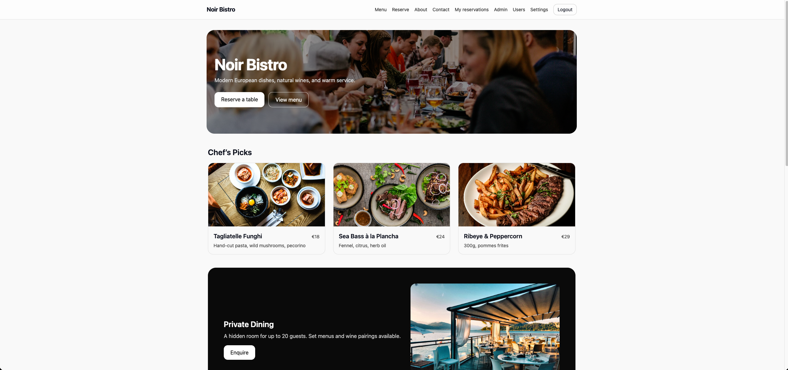
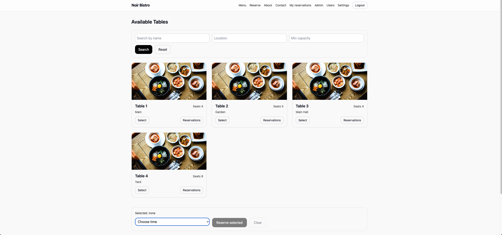
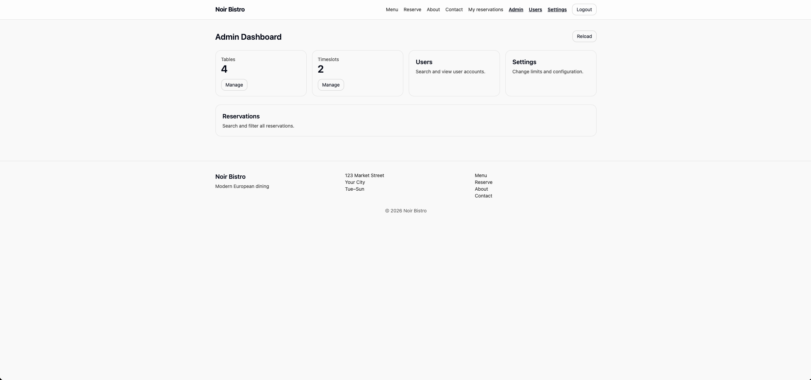
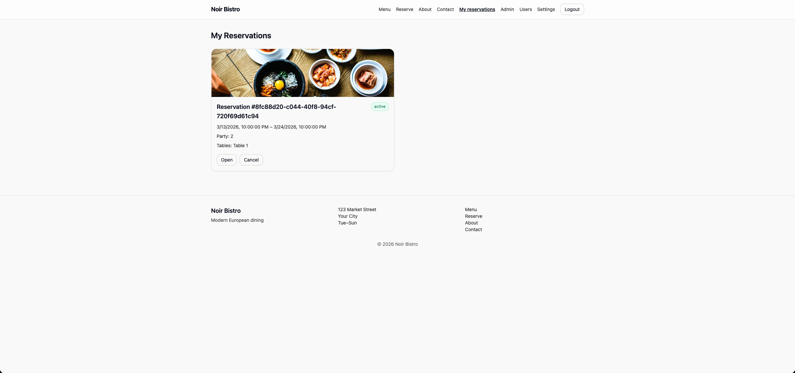

# Restaurant Reservation System

A full-stack restaurant reservation web application built with Svelte and Node.js.  
Users can browse available tables, make reservations, and manage bookings, while admins can manage tables, users, and reservations.

---

## 🚀 Features

- User registration and login  
- JWT authentication  
- Role-based authorization (user/admin)  
- Browse and reserve tables  
- Manage personal reservations  
- Admin dashboard (users, tables, reservations, timeslots)  
- REST API with Swagger documentation  
- Automated backend testing  

---

## 🛠 Tech Stack

### Frontend
- Svelte  
- Vite  
- Tailwind CSS  

### Backend
- Node.js  
- Express  
- Sequelize  
- SQLite  
- JWT Authentication  

---

## 📁 Project Structure

client/ # Frontend (Svelte)
server/ # Backend (Express API)
documentation/ # API, architecture, testing docs

---

## 📸 Screenshots

### Home

### Tables & Reservation

### Admin Dashboard

### My Reservations

---

## ⚙️ Getting Started

### 1. Clone the repository
git clone https://github.com/armineslamieh/restaurant-reservation-system.git
cd restaurant-reservation-system

2. Setup backend
Create a .env file in server/ based on .env.example.

Example:
PORT=3000
JWT_SECRET=your_secret_here
JWT_EXPIRES=1d
ADMIN_EMAIL=admin@local.dev
ADMIN_PASSWORD=change_me
CORS_ORIGINS=http://localhost:5173

3. Run backend
cd server
npm install
npm run dev

4. Run frontend
cd client
npm install
npm run dev

📚 API Documentation
Available at:
http://localhost:3000/docs

🧪 Testing
cd server
npm test
📈 What I Learned
Building a full-stack application with separate frontend and backend
Designing RESTful APIs
Implementing authentication and authorization (JWT)
Managing relational data using Sequelize
Writing automated backend tests

🔮 Future Improvements
Deploy application online
Add email confirmations
Improve UI/UX
Add analytics dashboard
